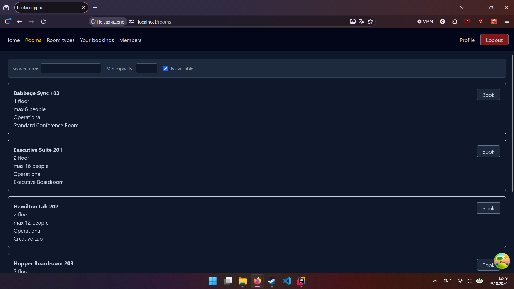
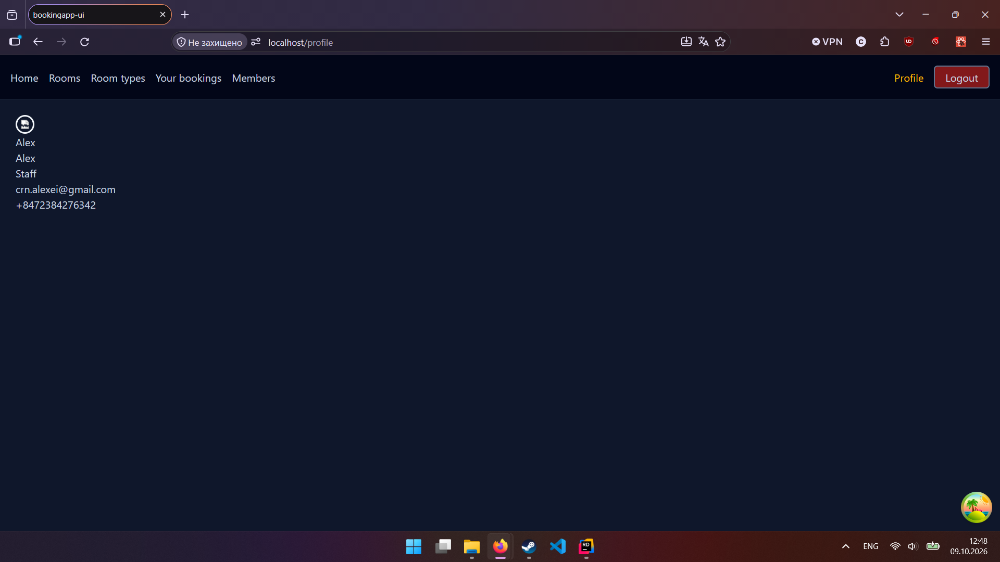
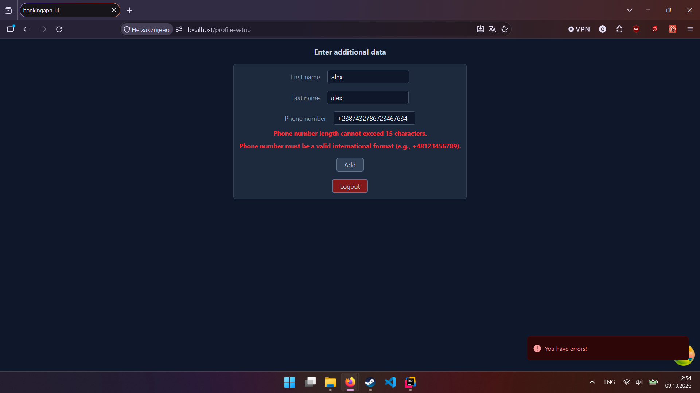
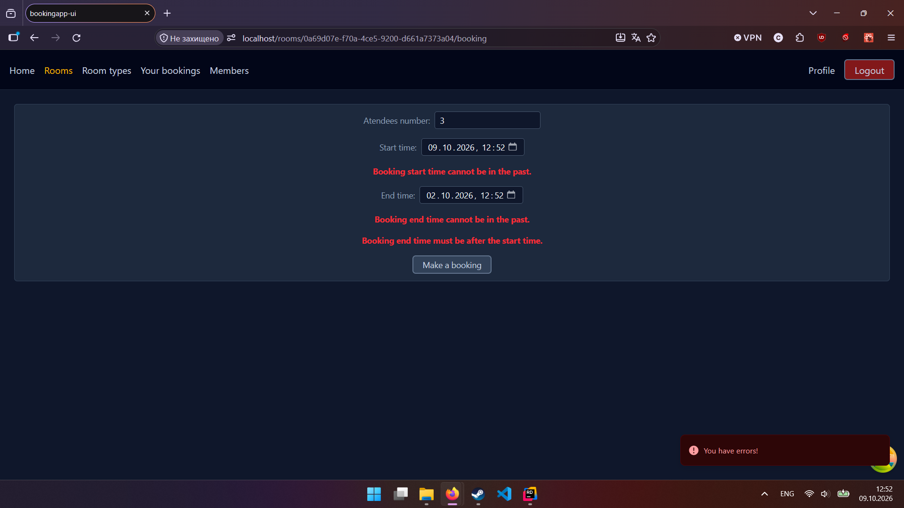
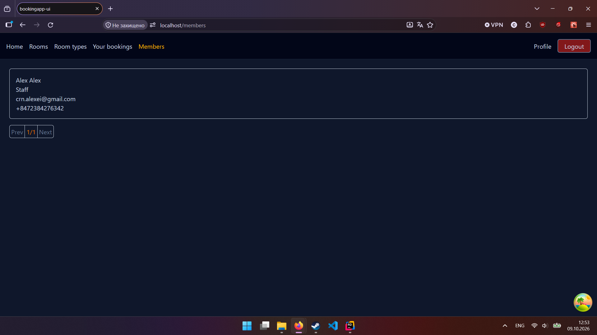

# BookingApp
A full-stack web application (ASP.NET Core + React) for managing and booking rooms.

# Preview
### Room Booking Dashboard

### Profile Dashboard

### Profile Addition Page (right after registration)

### Booking Addition Page

### Members Listing Page (restricted permission)


## Tech Stack & Tooling
* **Backend 🖥:** .NET 10, ASP.NET Core Web API, MediatR, Entity Framework Core, FluentValidation 
* **Frontend 🖥️:** React, Vite, TypeScript, Auth0 React SDK 
* **Infrastructure & DevOps 🛠️:** Docker, Docker Compose, Nginx, Auth0, GitHub Actions 
* **Testing 🧪:** xUnit, Moq, Testcontainers (PostgreSQL)

## Architecture overview
* **Frontend:** React application built with Vite and TypeScript. Authentication and authorization are handled via the Auth0 SDK using JWT tokens with role-based permissions.
* **Backend:** REST API following Clean Architecture principles split into four projects: `API`, `Application`, `Core`, and `Infrastructure`.
  * MediatR handles CQRS pipeline behaviors (validation via FluentValidation, logging) and domain event dispatching (DDD).
* **Database:** PostgreSQL using Entity Framework Core for Code-First migrations and data access.
* **Reverse Proxy:** Nginx routes external incoming traffic: standard web requests navigate to the React frontend container, while /api requests route to the backend container.
* **Containerization:** Orchestrated via docker-compose. Deployment flow follows a strict dependency chain: `PostgreSQL → EF Migrations → Backend API → Frontend → Nginx Proxy`
* **CI/CD & Testing:** Automated GitHub Actions workflows run unit and integration tests (using Testcontainers for isolated database testing) on every pull request before code can be merged.

## Prerequisites
Everything required on your machine for starting this project:
* **Docker Engine** v26.0+ & **Docker Compose** v2.0+
* **Git** (for pulling the project)
* **OpenSSL** (for local HTTPS development certificates)

## Environment Variables
Reference table for all required key-value pairs in .env.example:

| Variable | Description | Example |
| :--- | :--- | :--- |
|`POSTGRES_DB`|Production database name|`BookingAppDb`|
|`POSTGRES_USER`|DB admin username|`postgres`|
|`POSTGRES_PASSWORD`|DB admin password|`supersecret`|
|`AUTH0_DOMAIN`|Auth0 tenant domain|`random.auth0.com`|
|`AUTH0_AUDIENCE`|Backend API identifier|`http://localhost:8080`|
|`AUTH0_CLIENT_ID`|Auth0 Client ID|`CduhfhchdhhrbdbD`|
|`API_URL`|Base application URL|`https://localhost`|

## Getting started
```
# 1. Clone the repository
git clone https://github.com/CrANeZ2430/BookingApp.git
cd BookingApp

# 2. Set up environment variables
mv .env.example .env

# 3. Generate self-signed SSL certificates for local testing
mkdir -p nginx/certs
cd nginx/certs
openssl req -x509 -nodes -days 365 -newkey rsa:2048 \
 -keyout localhost.key -out localhost.crt
cd ../..

# 4. Build and run containers
docker compose up -d --build
```
### **Access points:**
* **Application Entrypoint (via Nginx Reverse Proxy):** 
  * `https://localhost`
* **Direct Container Endpoints (Debugging):**
  * Frontend (Vite): `http://localhost:3000`
  * Backend API: `http://localhost:8080`
  * PostgreSQL: `localhost:5432`
